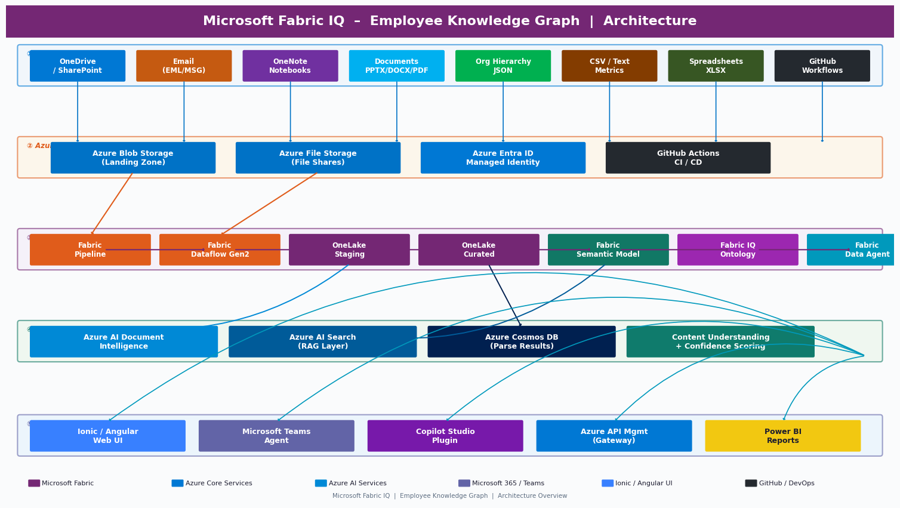
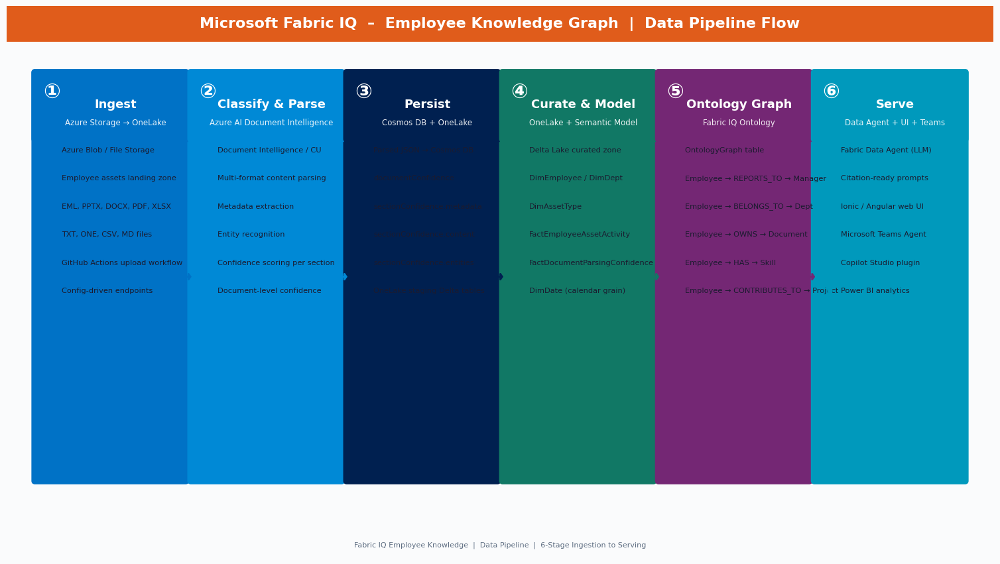
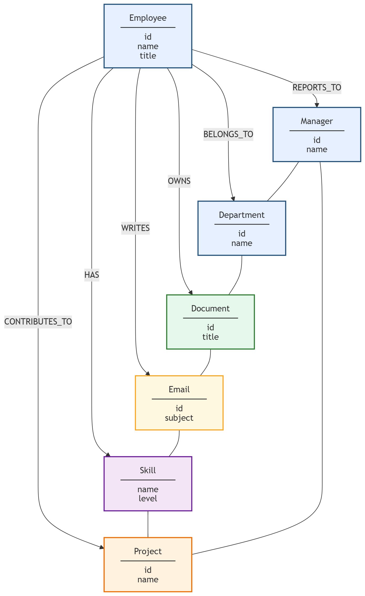

# Microsoft Fabric IQ – Employee Knowledge Graph Demo

> **Architecture diagrams and data-flow visuals are presented first below for quick reference, followed by full project documentation.**

## Table of Contents
- [Architecture](#architecture)
- [Data Pipeline in Microsoft Fabric](#data-pipeline-in-microsoft-fabric)
- [Semantic Model & ERD](#semantic-model--erd)
- [Fabric IQ Ontology](#fabric-iq-ontology)
- [Project Description](#project-description)
- [Folder Structure](#folder-structure)
- [Technologies Used](#technologies-used)
- [Configuration Strategy (No Hardcoding)](#configuration-strategy-no-hardcoding)
- [Deployment & Component URLs](#deployment--component-urls)
- [Synthetic Data Design](#synthetic-data-design)
- [Employee Asset Generation](#employee-asset-generation)
- [Project Data](#project-data)
- [Upload Workflow – Datasource Ingestion](#upload-workflow--datasource-ingestion)
- [Document Intelligence & Confidence Scoring](#document-intelligence--confidence-scoring)
- [Fabric Data Agent](#fabric-data-agent)
- [Ionic + Angular + TypeScript UI](#ionic--angular--typescript-ui)
- [Reusable Azure Hosting Resources (ai-myaacoub)](#reusable-azure-hosting-resources-ai-myaacoub)
- [Managed Identity Setup](#managed-identity-setup)
- [Private Networking Model](#private-networking-model)
- [Azure Monitor & SRE](#azure-monitor--sre)
- [Incident Response](#incident-response)
- [Prompt Catalog](#prompt-catalog)
- [Teams & Copilot Agent Packaging Steps](#teams--copilot-agent-packaging-steps)
- [GitHub Workflows](#github-workflows)
- [Terraform Deployment](#terraform-deployment)
- [Demo Script](#demo-script)
- [Best Practices](#best-practices)
- [License](#license)

## Architecture



## Data Pipeline in Microsoft Fabric



Flow summary:
1. Ingest from Azure Blob/File into OneLake staging
2. Run classification/parsing with Document Intelligence
3. Persist parse JSON to Cosmos DB
4. Load curated data into OneLake
5. Refresh semantic model for analytics and agent experiences

## Semantic Model & ERD


Semantic model definition:
- `fabric/semantic-model/employee_knowledge_semantic_model.json`

## Fabric IQ Ontology



Ontology artifacts:
- `fabric/ontology/fabric_iq_ontology.json`
- `config/ontology-config.json`

## Project Description
This repository provides a complete **demo blueprint** for implementing an **Employee Knowledge Graph** use case with **Microsoft Fabric IQ**.

It includes:
- Config-driven endpoints and runtime settings
- Synthetic enterprise data for 100 employees and multi-format digital assets
- Fabric-style dataflow/pipeline artifacts
- Document intelligence parsing outputs with section/document confidence
- OneLake semantic model definitions and ontology mapping
- Fabric Data Agent prompt pack with citation-ready prompts
- Ionic/Angular/TypeScript UI scaffold with responsive layouts and document browsing

## Folder Structure
```text
.
├── config/
│   ├── azure-hosting-resources.json
│   ├── endpoints.json
│   ├── fabric-settings.json
│   ├── ontology-config.json
│   ├── workflows.json
│   └── terraform.tfvars.json
├── .github/workflows/
│   ├── ci.yml
│   ├── deploy.yml
│   └── upload-employee-assets.yml
├── data/
│   ├── employees.json
│   ├── digital_assets.json
│   ├── emails.json
│   ├── org_hierarchy.json
│   ├── projects.json
│   ├── parsed_documents_cosmosdb.json
│   ├── storage_map.json
│   └── employees/
├── scripts/
│   └── generate_employee_files.py
├── docs/
│   ├── architecture-diagram.png
│   ├── architecture-diagram.svg
│   ├── data-pipeline-diagram.png
│   ├── data-pipeline-diagram.svg
│   ├── semantic-model-erd.png
│   ├── semantic-model-erd.svg
│   ├── ontology-diagram.png
│   ├── ontology-diagram.svg
│   ├── prompts.txt
│   ├── incident-response-plan.md
│   ├── DEMO_SCRIPT.md
│   └── ui-preview.html
├── fabric/
│   ├── dataflows/
│   ├── pipelines/
│   ├── semantic-model/
│   ├── ontology/
│   └── agents/
├── ui/
│   └── ionic-angular/
├── terraform/
│   ├── main.tf
│   ├── monitors.tf
│   ├── variables.tf
│   ├── outputs.tf
│   └── versions.tf
├── LICENSE
└── README.md
```

## Technologies Used
- **Microsoft Fabric** (OneLake, Pipelines, Dataflows, Semantic Models, Data Agent)
- **Azure Storage** (Blob/File landing zones)
- **Azure AI Document Intelligence / Content Understanding**
- **Azure Cosmos DB** (parsed JSON outputs, incident records)
- **Azure Monitor** (Diagnostic Settings, Metric Alerts, Scheduled Query Rules)
- **Azure Log Analytics** (centralized log aggregation and query)
- **Azure Logic Apps** (HTTP trigger-based incident response orchestration)
- **Ionic + Angular + TypeScript** (UI)
- **JSON/SVG** artifacts for demo portability

## Configuration Strategy (No Hardcoding)
All platform endpoints and runtime options are centralized in `/config`:
- `config/endpoints.json`: Azure/Fabric/integration URLs and IDs
- `config/fabric-settings.json`: ingestion behavior, thresholds, and networking policy flags
- `config/azure-hosting-resources.json`: reusable existing hosting resources in `ai-myaacoub`
- `config/ontology-config.json`: ontology name, entities, and relationship catalog

## Deployment & Component URLs
| Component | URL / Link | Source |
|---|---|---|
| UI Web App | https://fabric-iq-emp-knowledge-ui.azurewebsites.net | `config/endpoints.json` (`hosting.uiPublicUrl`) |
| API Web App | https://foundry-privatevnet-api.azurewebsites.net | `config/endpoints.json` (`hosting.apiUrl`) |
| API Management Gateway | https://ai-gateway-apim-poc-my.azure-api.net | `config/endpoints.json` (`azure.apiManagementGateway`) |
| Azure Blob Storage Endpoint | https://aistoragemyaacoub.blob.core.windows.net | `config/endpoints.json` (`azure.blobStorageEndpoint`) |
| Azure File Storage Endpoint | https://aistoragemyaacoub.file.core.windows.net | `config/endpoints.json` (`azure.fileStorageEndpoint`) |
| Cosmos DB Endpoint | https://cosmos-ai-poc.documents.azure.com:443/ | `config/endpoints.json` (`azure.cosmosDbEndpoint`) |
| Azure AI Search Endpoint | https://aisearch-poc-myaacoub.search.windows.net | `config/endpoints.json` (`azure.aiSearchEndpoint`) |
| Azure Foundry Project Endpoint | https://002-ai-poc-private.services.ai.azure.com/api/projects/proj-default | `config/endpoints.json` (`azure.foundryProjectEndpoint`) |
| Fabric IQ Ontology Artifact | [fabric/ontology/fabric_iq_ontology.json](fabric/ontology/fabric_iq_ontology.json) | Repository artifact |
| Fabric Ontology Diagram | [docs/ontology-diagram.png](docs/ontology-diagram.png) | Repository documentation |
| Teams Developer Portal | https://dev.teams.microsoft.com | `config/endpoints.json` (`integration.teamsDevPortalUrl`) |
| Copilot Studio | https://copilotstudio.microsoft.com | `config/endpoints.json` (`integration.copilotStudioUrl`) |

## Synthetic Data Design
Data includes **100 employees** and enterprise digital assets expected in Lam Research-like environments.

Primary files:
- `data/employees.json`
- `data/digital_assets.json` – **800 assets total (8 per employee)**
- `data/emails.json` – **100 emails (1 per employee)**
- `data/org_hierarchy.json`
- `data/storage_map.json`
- `data/parsed_documents_cosmosdb.json` – **800 parse records**

## Employee Asset Generation
`data/employees/` now contains **900 generated files** total (9 per employee × 100 employees).

### File types per employee
| File | Type |
|------|------|
| `EML-EMPXXX.eml` | Email |
| `AST-EMPXXX-01.pptx` | Presentation |
| `AST-EMPXXX-02.pdf` | PDF |
| `AST-EMPXXX-03.docx` | Word |
| `AST-EMPXXX-04.txt` | Text |
| `AST-EMPXXX-05.one` | OneNote export |
| `AST-EMPXXX-06.xlsx` | Spreadsheet |
| `AST-EMPXXX-07.csv` | CSV metrics export |
| `AST-EMPXXX-08.md` | Markdown knowledge notes |

### Regenerating files
```bash
pip install python-pptx python-docx openpyxl reportlab
python scripts/generate_employee_files.py
```

## Project Data
`data/projects.json` contains **20 synthetic projects** spanning all departments and employee groups.

Each project record includes:
- `projectId` – unique identifier (e.g. `PRJ001`)
- `name` – descriptive project title
- `description` – business context and goals
- `department` – owning department (Manufacturing, R&D, IT, HR, Procurement, Operations, Finance)
- `status` – `Active`, `Completed`, or `Planning`
- `startDate` / `endDate` – ISO-8601 dates (endDate is `null` for ongoing projects)
- `employeeIds` – list of assigned employees (3–7 per project)
- `skills` – required skills matching the employee skill ontology

The ontology edge `Employee → CONTRIBUTES_TO → Project` is defined in:
- `fabric/ontology/fabric_iq_ontology.json`
- `config/ontology-config.json`

Project data is uploaded to `employee-knowledge-raw/projects.json` on Azure Blob Storage and ingested by the `IngestProjectData` pipeline activity.


## Upload Workflow – Datasource Ingestion
`.github/workflows/upload-employee-assets.yml` uploads all generated employee assets from `data/employees/` to Azure Blob Storage.

## Document Intelligence & Confidence Scoring
Parsed output is persisted in `data/parsed_documents_cosmosdb.json`.

Each document record includes:
- `documentConfidence`
- `sectionConfidence.metadata`
- `sectionConfidence.content`
- `sectionConfidence.entities`
- employee ownership and classification category

## Fabric Data Agent
Agent package metadata:
- `fabric/agents/employee_knowledge_agent.json`

The 20 sample prompts are now citation-oriented and explicitly instruct responses to include:
- `documentId`
- `cosmosDbRecordId`
- `storageRef.relativePath`

## Ionic + Angular + TypeScript UI
UI scaffold:
- `ui/ionic-angular/`

Implemented page capabilities:
- **Data Sources**: employee + asset search autocomplete, filtering, pagination, and asset list browsing
- **Projects**: browse 20 employee-linked projects; filter by department/status; view team assignments and required skills
- **Document Viewer**: in-browser preview flow for pptx/docx/pdf/one/txt/eml/csv/md (with format-aware rendering strategy)
- **Ingestion & Intelligence**: Fabric pipeline and intelligence layer narrative
- **Data Agent Prompts**: prompt interactions aligned with citation requirements
- **Agent Packaging**: Teams/Copilot packaging flow

Preview page:
- `docs/ui-preview.html`

## Reusable Azure Hosting Resources (ai-myaacoub)
This repository now includes reusable hosting/network metadata under:
- `config/azure-hosting-resources.json`

Configured references include:
- Resource group: `ai-myaacoub`
- UI web app: `fabric-iq-emp-knowledge-ui` (new, dedicated, public) — reuses `plan-taxforms` App Service Plan
- API web app: `foundry-privatevnet-api`
- APIM: `ai-gateway-apim-poc-my`
- AI Search: `aisearch-poc-myaacoub`
- Foundry account: `002-ai-poc-private`
- Cosmos DB: `cosmos-ai-poc`
- Storage account: `aistoragemyaacoub`
- Existing VNet and private endpoint naming guidance

## Managed Identity Setup
Use managed identities for app-to-data-plane access instead of secrets.

1. Enable **System Assigned Managed Identity** on app hosts (API/UI or backend workers).
2. Grant least-privilege RBAC on required resources:
   - Storage: `Storage Blob Data Reader/Contributor` as needed
   - Cosmos DB: `Cosmos DB Built-in Data Reader/Contributor` as needed
   - APIM/Foundry integrations: only required role scopes
3. Remove embedded credentials from app settings and use Entra token-based auth.
4. Validate token acquisition and resource access paths before production rollout.

## Private Networking Model
Private connectivity is expected for all data-plane services except UI exposure.

Policy flags are in `config/fabric-settings.json`:
- `networking.usePrivateEndpoints = true`
- `networking.useExistingVnet = true`
- `networking.uiInternetExposed = true`

Expected pattern:
- **Private**: Storage, Cosmos DB, AI Search, Foundry
- **Public**: UI endpoint only

## Azure Monitor & SRE

All managed resources are instrumented with Azure Monitor diagnostics and metric alerts, deployed via `terraform/monitors.tf`.

### Diagnostic Settings

| Resource | Log Categories | Metrics |
|----------|---------------|---------|
| Storage Account (`stfabriciqdemodata01`) | StorageRead, StorageWrite, StorageDelete | Transaction |
| Cosmos DB (`cosmos-fabriciq-demo-01`) | DataPlaneRequests, QueryRuntimeStatistics, PartitionKeyStatistics, ControlPlaneRequests | Requests |
| UI App Service (`fabric-iq-emp-knowledge-ui`) | AppServiceHTTPLogs, AppServiceConsoleLogs, AppServiceAppLogs | AllMetrics |

All diagnostic logs route to a **Log Analytics workspace** (`law-fabriciq-emp-knowledge` or an existing workspace in `ai-myaacoub` if `existing_log_analytics_workspace_name` is set in `config/terraform.tfvars.json`).

### Alert Rules

| Alert | Threshold | Severity |
|-------|-----------|----------|
| Storage availability | Average < 99% over 15 min | Sev 1 |
| Cosmos DB 5xx errors | Count > 5 in 5 min | Sev 1 |
| Cosmos DB 429 throttling | Count > 10 in 5 min | Sev 2 |
| UI App Service HTTP 5xx | Count > 5 in 5 min | Sev 1 |
| UI App Service response time | Average > 5s over 15 min | Sev 2 |
| Low parse confidence (scheduled query) | > 10 docs with confidence < 0.5 in 1 hr | Sev 2 |

### SRE Action Group

The **SRE Action Group** (`ag-fabriciq-sre`) is provisioned in the `ai-myaacoub` resource group, reusing the shared SRE notification infrastructure. It can notify via:
- **Email** – set `sre_alert_email` in `config/terraform.tfvars.json`
- **Webhook** – set `sre_webhook_url` to the Logic App trigger URL (captured from `terraform output incident_response_logic_app_trigger_url`)

To reuse an existing Log Analytics workspace in `ai-myaacoub`, set `existing_log_analytics_workspace_name` in `config/terraform.tfvars.json` to the workspace name.

### Incident Response Logic App

The **Logic App** (`logic-fabriciq-incident-response`) provides an HTTP trigger that acts as the alert webhook receiver. When an alert fires it:
1. Parses the Azure Monitor common alert schema payload
2. Logs an incident record to the Cosmos DB `Incidents` container
3. Sends a Teams MessageCard to the SRE channel

After first `terraform apply`, run:
```bash
terraform output -raw incident_response_logic_app_trigger_url
```
Set this URL as `sre_webhook_url` in `config/terraform.tfvars.json` and re-apply to wire the full end-to-end flow.

## Incident Response

The full incident response plan is maintained at:
- **[docs/incident-response-plan.md](docs/incident-response-plan.md)**

It includes:
- Severity level definitions (Sev 1–4) with response SLAs
- Per-alert playbooks: triage steps, remediation, and escalation triggers
- Escalation matrix with roles, contact methods, and conditions
- Post-incident review process and incident record schema (Cosmos DB `Incidents` container)

## Prompt Catalog
Prompt requirements are consolidated and organized in:
- `docs/prompts.txt`

This file includes:
- Original baseline scope requirements (Section 1)
- Enhancement requirements (Section 2)
- Citation behavior requirements for prompts/agent responses (Section 3)
- Azure Monitor & SRE requirements (Section 4)
- Incident response requirements (Section 5)
- Architecture & demo documentation requirements (Section 6)

## Teams & Copilot Agent Packaging Steps
1. Export agent definition from `fabric/agents/employee_knowledge_agent.json`
2. Package as `FabricEmployeeKnowledgeAgent.zip`
3. Open Teams Developer Portal: <https://dev.teams.microsoft.com>
4. Import zip package as custom agent/app
5. Validate prompt execution and data access permissions
6. Publish for Teams and Microsoft Copilot usage

## GitHub Workflows
- `.github/workflows/ci.yml`: JSON/UI/Terraform validation checks
- `.github/workflows/deploy.yml`: deployment packaging and Terraform plan/apply flow
- `.github/workflows/upload-employee-assets.yml`: asset upload to Azure Blob, with dry-run mode

## Terraform Deployment
Terraform resources are in `terraform/` and use values from:
- `config/terraform.tfvars.json`

Modules:
- `terraform/main.tf` – core resources (Storage, Cosmos DB, App Service)
- `terraform/monitors.tf` – Azure Monitor resources (Log Analytics, Action Group, Diagnostic Settings, Metric Alerts, Scheduled Query Rules, Logic App)
- `terraform/variables.tf` – all input variables including monitor variables
- `terraform/outputs.tf` – outputs including monitor action group ID and Logic App trigger URL

Typical commands:
```bash
cd terraform
terraform init
terraform plan -var-file=../config/terraform.tfvars.json
terraform apply -var-file=../config/terraform.tfvars.json
```

After apply, wire the Logic App webhook:
```bash
# Capture Logic App HTTP trigger URL and update sre_webhook_url in config/terraform.tfvars.json
terraform output -raw incident_response_logic_app_trigger_url
```

Monitor variables (set in `config/terraform.tfvars.json`):

| Variable | Default | Description |
|----------|---------|-------------|
| `monitor_resource_group_name` | `ai-myaacoub` | RG for SRE monitor resources |
| `existing_log_analytics_workspace_name` | `""` | Existing workspace name to reuse; leave empty to create new |
| `sre_alert_email` | `""` | SRE email DL for alert notifications |
| `sre_webhook_url` | `""` | Logic App HTTP trigger URL (set after first apply) |

## Demo Script

A comprehensive step-by-step demo script is available at:
- **[docs/DEMO_SCRIPT.md](docs/DEMO_SCRIPT.md)**

The demo script covers:
- Prerequisites and setup commands
- Full 30–45 minute demo (8 Acts): architecture, data pipeline, semantic model, UI walk-through, Data Agent prompts, Azure Monitor dashboard, incident response flow, Teams/Copilot packaging
- Sample Data Agent prompts with expected citation response format
- Abbreviated 15-minute demo path
- Q&A talking points

## Best Practices
- Keep endpoints and IDs in `/config` only
- Prefer managed identities over secret-based access
- Keep private endpoints and VNet boundaries for data-plane services
- Expose only UI publicly when required
- Track confidence metrics for governance and reprocessing
- Maintain a prompt catalog with explicit citation expectations
- Keep UI responsive and task-oriented for web/tablet/mobile
- Enable diagnostic settings on all managed resources from day one
- Route all alerts to a shared SRE action group for consistent incident routing
- Log incident records to Cosmos DB for trend analysis and post-incident review
- Review and update alert thresholds after model updates or traffic changes

## License
See [LICENSE](LICENSE).
