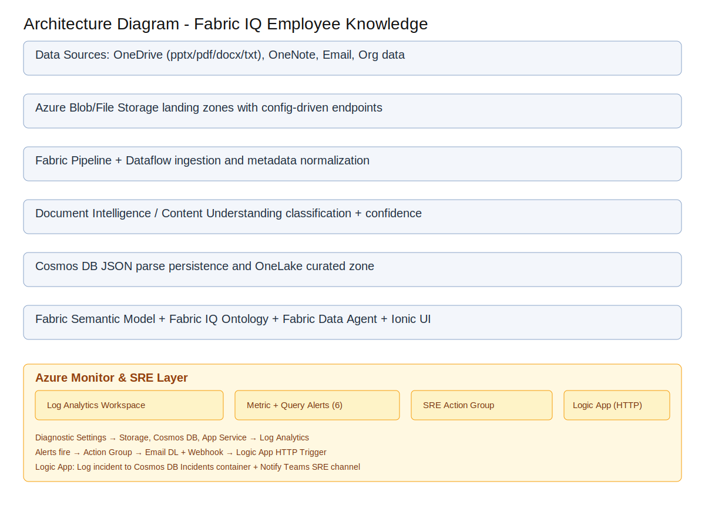
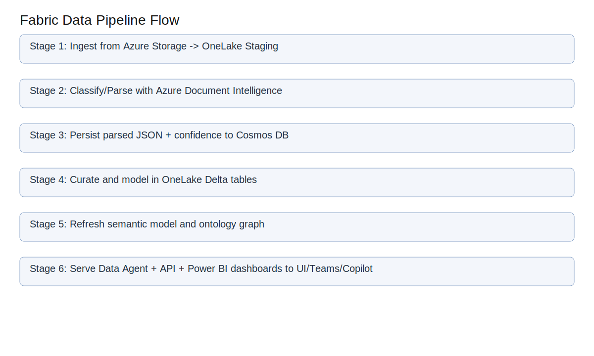
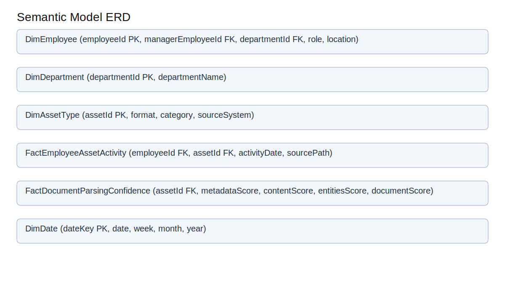
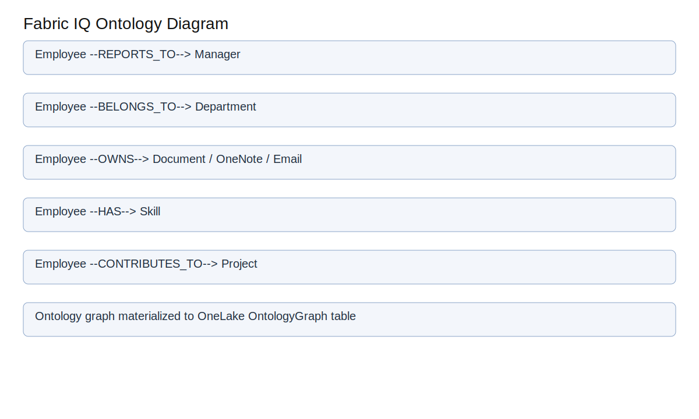
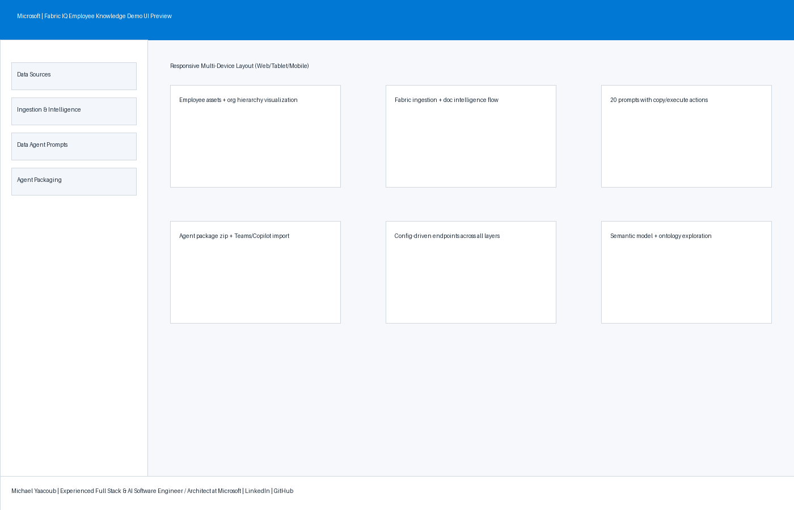

# Microsoft Fabric IQ – Employee Knowledge Graph Demo

## Table of Contents
- [Project Description](#project-description)
- [Architecture](#architecture)
- [Folder Structure](#folder-structure)
- [Technologies Used](#technologies-used)
- [Configuration Strategy (No Hardcoding)](#configuration-strategy-no-hardcoding)
- [Synthetic Data Design](#synthetic-data-design)
- [Data Pipeline in Microsoft Fabric](#data-pipeline-in-microsoft-fabric)
- [Document Intelligence & Confidence Scoring](#document-intelligence--confidence-scoring)
- [Semantic Model & ERD](#semantic-model--erd)
- [Fabric IQ Ontology](#fabric-iq-ontology)
- [Fabric Data Agent](#fabric-data-agent)
- [Ionic + Angular + TypeScript UI](#ionic--angular--typescript-ui)
- [Teams & Copilot Agent Packaging Steps](#teams--copilot-agent-packaging-steps)
- [Best Practices](#best-practices)
- [License](#license)

## Project Description
This repository provides a complete **demo blueprint** for implementing an **Employee Knowledge Graph** use case with **Microsoft Fabric IQ**.  
It includes:
- Config-driven endpoints and runtime settings
- Synthetic enterprise data for 100 employees and digital assets
- Fabric-style dataflow/pipeline artifacts
- Document intelligence parsing outputs with section/document confidence
- OneLake semantic-model definitions and ontology mapping
- Fabric Data Agent prompt pack (20 prompts)
- Ionic/Angular/TypeScript UI scaffold with responsive layouts (web/tablet/mobile)

## Architecture


## Folder Structure
```text
.
├── config/
│   ├── endpoints.json
│   ├── fabric-settings.json
│   └── ontology-config.json
├── data/
│   ├── employees.json
│   ├── digital_assets.json
│   ├── emails.json
│   ├── org_hierarchy.json
│   ├── parsed_documents_cosmosdb.json
│   └── storage_map.json
├── docs/
│   ├── architecture-diagram.svg
│   ├── data-pipeline-diagram.svg
│   ├── semantic-model-erd.svg
│   ├── ontology-diagram.svg
│   ├── prompts.txt
│   └── ui-preview.html
├── fabric/
│   ├── dataflows/
│   ├── pipelines/
│   ├── semantic-model/
│   ├── ontology/
│   └── agents/
├── ui/
│   └── ionic-angular/
├── LICENSE
└── README.md
```

## Technologies Used
- **Microsoft Fabric** (OneLake, Pipelines, Dataflows, Semantic Models, Data Agent)
- **Azure Storage** (Blob/File landing zones)
- **Azure AI Document Intelligence / Content Understanding**
- **Azure Cosmos DB** (parsed JSON outputs)
- **Ionic + Angular + TypeScript** (UI)
- **JSON/SVG** artifacts for demo portability

## Configuration Strategy (No Hardcoding)
All platform endpoints and runtime options are centralized in `/config`:
- `config/endpoints.json`: Azure + Fabric + integration URLs/IDs
- `config/fabric-settings.json`: ingestion behavior, thresholds, storage names
- `config/ontology-config.json`: ontology name, entities, and relationship catalog

UI and pipeline artifacts reference config files rather than embedding environment values directly.

## Synthetic Data Design
Data includes **100 employees** and enterprise digital assets expected in Lam Research-like environments:
- OneDrive assets in multiple formats: **pptx, pdf, docx, txt, one (OneNote)**
- Employee email records and ownership metadata
- Reporting hierarchy with manager mappings
- Azure storage paths mapped for raw/processed zones and OneLake target paths

Primary data files:
- `data/employees.json`
- `data/digital_assets.json`
- `data/emails.json`
- `data/org_hierarchy.json`
- `data/storage_map.json`

## Data Pipeline in Microsoft Fabric


Pipeline artifacts:
- `fabric/dataflows/employee_ingestion_dataflow.json`
- `fabric/pipelines/employee_knowledge_pipeline.json`

Flow summary:
1. Ingest from Azure Blob/File into OneLake staging
2. Run classification/parsing with Document Intelligence
3. Persist parse JSON to Cosmos DB
4. Load curated data into OneLake
5. Refresh semantic model for analytics and agent experiences

## Document Intelligence & Confidence Scoring
Parsed output is persisted in:
- `data/parsed_documents_cosmosdb.json`

Each document record includes:
- `documentConfidence`
- `sectionConfidence.metadata`
- `sectionConfidence.content`
- `sectionConfidence.entities`
- employee ownership and classification category

This enables confidence rollups **by field section and by document**.

## Semantic Model & ERD


Semantic model definition:
- `fabric/semantic-model/employee_knowledge_semantic_model.json`

Fact/Dimension layout:
- Facts: parsing confidence, employee asset activity
- Dimensions: employee, department, asset type, date

## Fabric IQ Ontology


Ontology artifacts:
- `fabric/ontology/fabric_iq_ontology.json`
- `config/ontology-config.json`

Core business entities are linked to OneLake graph-oriented tables for query and agent grounding.

## Fabric Data Agent
Data agent package metadata is defined in:
- `fabric/agents/employee_knowledge_agent.json`

Includes **20 sample prompts** for employee-knowledge analysis (copy/execute scenarios for chat UX).

## Ionic + Angular + TypeScript UI
UI scaffold is located in:
- `ui/ionic-angular/`

Implemented pages with left navigation:
- Data Sources (employee assets + org hierarchy)
- Ingestion & Intelligence (Fabric flow + parsing layer)
- Data Agent Prompts (copy/execute prompt interactions)
- Agent Packaging (zip export + Teams/Copilot import)

Responsive behavior is included for:
- **Web** (3-column content emphasis)
- **Tablet** (2-column layout)
- **Mobile** (single-column stack)

Preview page for quick visual:
- `docs/ui-preview.html`

UI screenshot:


## Teams & Copilot Agent Packaging Steps
1. Export agent definition from `fabric/agents/employee_knowledge_agent.json`
2. Package as `FabricEmployeeKnowledgeAgent.zip`
3. Open Teams Developer Portal: <https://dev.teams.microsoft.com>
4. Import the zip package as a custom agent/app
5. Validate prompt execution and data access permissions
6. Publish for Teams and Microsoft Copilot usage

## Best Practices
- Keep endpoints and IDs in `/config` only
- Use staged zones (raw → processed → curated) in OneLake
- Track confidence metrics for governance and reprocessing
- Separate semantic model and ontology concerns for maintainability
- Maintain prompt catalog for reusable business query patterns
- Keep UI responsive and task-oriented for different device classes

## License
See [LICENSE](LICENSE).
