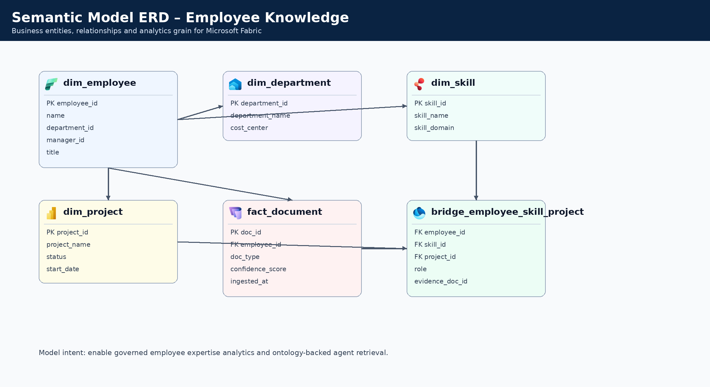

# Microsoft Fabric IQ – Employee Knowledge Graph Demo

> **Architecture diagrams and data-flow visuals are presented first below for quick reference, followed by full project documentation.**

## Table of Contents
- [Architecture](#architecture)
- [Data Pipeline in Microsoft Fabric](#data-pipeline-in-microsoft-fabric)
- [Semantic Model & ERD](#semantic-model--erd)
- [Fabric IQ Ontology](#fabric-iq-ontology)
- [Project Description](#project-description)
- [Folder Structure](#folder-structure)
- [Technologies Used](#technologies-used)
- [Configuration Strategy (No Hardcoding)](#configuration-strategy-no-hardcoding)
- [Deployment & Component URLs](#deployment--component-urls)
- [Synthetic Data Design](#synthetic-data-design)
- [Employee Asset Generation](#employee-asset-generation)
- [Project Data](#project-data)
- [Upload Workflow – Datasource Ingestion](#upload-workflow--datasource-ingestion)
- [Document Intelligence & Confidence Scoring](#document-intelligence--confidence-scoring)
- [API Service](#api-service)
- [Power BI Dashboard Artifacts](#power-bi-dashboard-artifacts)
- [Fabric Data Agent](#fabric-data-agent)
- [Ionic + Angular + TypeScript UI](#ionic--angular--typescript-ui)
- [UI Troubleshooting (Why UI May Not Render)](#ui-troubleshooting-why-ui-may-not-render)
- [Sample Agent Prompts (30)](#sample-agent-prompts-30)
- [Reusable Azure Hosting Resources (ai-myaacoub)](#reusable-azure-hosting-resources-ai-myaacoub)
- [Managed Identity Setup](#managed-identity-setup)
- [Private Networking Model](#private-networking-model)
- [Azure Monitor & SRE](#azure-monitor--sre)
- [Incident Response](#incident-response)
- [Prompt Catalog](#prompt-catalog)
- [Teams & Copilot Agent Packaging Steps](#teams--copilot-agent-packaging-steps)
- [GitHub Workflows](#github-workflows)
- [GitHub Secrets Setup](#github-secrets-setup)
- [Terraform Deployment](#terraform-deployment)
- [Demo Script](#demo-script)
- [Best Practices](#best-practices)
- [License](#license)

## Architecture


## Data Pipeline in Microsoft Fabric


Flow summary:
1. Ingest from Azure Blob/File into OneLake staging
2. Run classification/parsing with Document Intelligence
3. Persist parse JSON to Cosmos DB
4. Load curated data into OneLake
5. Refresh semantic model for analytics and agent experiences
6. Serve data through API + Power BI report/dashboard experiences

## Semantic Model & ERD



Semantic model definition:
- `fabric/semantic-model/employee_knowledge_semantic_model.json`

## Fabric IQ Ontology


Ontology artifacts:
- `fabric/ontology/fabric_iq_ontology.json`
- `config/ontology-config.json`

## Project Description
This repository provides a complete **demo blueprint** for implementing an **Employee Knowledge Graph** use case with **Microsoft Fabric IQ**.

It includes:
- Config-driven endpoints and runtime settings
- Synthetic enterprise data for 100 employees and multi-format digital assets
- Fabric-style dataflow/pipeline artifacts
- Document intelligence parsing outputs with section/document confidence
- OneLake semantic model definitions and ontology mapping
- Fabric Data Agent prompt pack with citation-ready prompts
- Ionic/Angular/TypeScript UI scaffold with responsive layouts and document browsing

## Folder Structure
```text
.
├── config/
│   ├── azure-hosting-resources.json
│   ├── endpoints.json
│   ├── fabric-settings.json
│   ├── ontology-config.json
│   ├── workflows.json
│   └── terraform.tfvars.json
├── .github/workflows/
│   ├── ci.yml
│   ├── deploy.yml
│   ├── upload-employee-assets.yml
│   └── provision-sre-agent.yml
├── data/
│   ├── employees.json
│   ├── digital_assets.json
│   ├── emails.json
│   ├── org_hierarchy.json
│   ├── projects.json
│   ├── parsed_documents_cosmosdb.json
│   ├── storage_map.json
│   └── employees/
├── api/
│   ├── server.py
│   └── README.md
├── scripts/
│   └── generate_employee_files.py
├── docs/
│   ├── architecture-diagram.png
│   ├── architecture-diagram.svg
│   ├── data-pipeline-diagram.png
│   ├── data-pipeline-diagram.svg
│   ├── semantic-model-erd.png
│   ├── semantic-model-erd.svg
│   ├── ontology-diagram.png
│   ├── ontology-diagram.svg
│   ├── prompts.txt
│   ├── incident-response-plan.md
│   ├── DEMO_SCRIPT.md
│   └── ui-preview.html
├── fabric/
│   ├── dataflows/
│   ├── pipelines/
│   ├── semantic-model/
│   ├── ontology/
│   ├── agents/
│   └── powerbi/
├── ui/
│   └── ionic-angular/
├── terraform/
│   ├── main.tf
│   ├── monitors.tf
│   ├── variables.tf
│   ├── outputs.tf
│   └── versions.tf
├── LICENSE
└── README.md
```

## Technologies Used
- **Microsoft Fabric** (OneLake, Pipelines, Dataflows, Semantic Models, Data Agent)
- **Azure Storage** (Blob/File landing zones)
- **Azure AI Document Intelligence / Content Understanding**
- **Azure Cosmos DB** (parsed JSON outputs, incident records)
- **Azure Monitor** (Diagnostic Settings, Metric Alerts, Scheduled Query Rules)
- **Azure Log Analytics** (centralized log aggregation and query)
- **Azure Logic Apps** (HTTP trigger-based incident response orchestration)
- **Python API** (standard-library HTTP server + OpenAPI/Swagger UI)
- **Ionic + Angular + TypeScript** (UI)
- **JSON/SVG** artifacts for demo portability

## Configuration Strategy (No Hardcoding)
All platform endpoints and runtime options are centralized in `/config`:
- `config/endpoints.json`: Azure/Fabric/integration URLs and IDs
- `config/fabric-settings.json`: ingestion behavior, thresholds, and networking policy flags
- `config/azure-hosting-resources.json`: reusable existing hosting resources in `ai-myaacoub`
- `config/ontology-config.json`: ontology name, entities, and relationship catalog

## Deployment & Component URLs
| Component | URL / Link | Source |
|---|---|---|
| UI Web App | https://fabric-iq-emp-knowledge-ui.azurewebsites.net | `config/endpoints.json` (`hosting.uiPublicUrl`) |
| API Web App | https://fabric-iq-emp-knowledge-api.azurewebsites.net | `config/endpoints.json` (`hosting.apiUrl`) |
| API Swagger UI | https://fabric-iq-emp-knowledge-api.azurewebsites.net/swagger | API route served by `api/server.py` |
| API Management Gateway | https://ai-gateway-apim-poc-my.azure-api.net | `config/endpoints.json` (`azure.apiManagementGateway`) |
| Azure Blob Storage Endpoint | https://aistoragemyaacoub.blob.core.windows.net | `config/endpoints.json` (`azure.blobStorageEndpoint`) |
| Azure File Storage Endpoint | https://aistoragemyaacoub.file.core.windows.net | `config/endpoints.json` (`azure.fileStorageEndpoint`) |
| Cosmos DB Endpoint | https://cosmos-ai-poc.documents.azure.com:443/ | `config/endpoints.json` (`azure.cosmosDbEndpoint`) |
| Azure AI Search Endpoint | https://aisearch-poc-myaacoub.search.windows.net | `config/endpoints.json` (`azure.aiSearchEndpoint`) |
| Azure Foundry Project Endpoint | https://002-ai-poc-private.services.ai.azure.com/api/projects/proj-default | `config/endpoints.json` (`azure.foundryProjectEndpoint`) |
| Fabric IQ Ontology Artifact | [fabric/ontology/fabric_iq_ontology.json](fabric/ontology/fabric_iq_ontology.json) | Repository artifact |
| Fabric Ontology Diagram | [docs/ontology-diagram.png](docs/ontology-diagram.png) | Repository documentation |
| Teams Developer Portal | https://dev.teams.microsoft.com | `config/endpoints.json` (`integration.teamsDevPortalUrl`) |
| Copilot Studio | https://copilotstudio.microsoft.com | `config/endpoints.json` (`integration.copilotStudioUrl`) |

## Synthetic Data Design
Data includes **100 employees** and enterprise digital assets expected in Lam Research-like environments.

Primary files:
- `data/employees.json`
- `data/digital_assets.json` – **800 assets total (8 per employee)**
- `data/emails.json` – **100 emails (1 per employee)**
- `data/org_hierarchy.json`
- `data/storage_map.json`
- `data/parsed_documents_cosmosdb.json` – **800 parse records**

## Employee Asset Generation
`data/employees/` now contains **900 generated files** total (9 per employee × 100 employees).

### File types per employee
| File | Type |
|------|------|
| `EML-EMPXXX.eml` | Email |
| `AST-EMPXXX-01.pptx` | Presentation |
| `AST-EMPXXX-02.pdf` | PDF |
| `AST-EMPXXX-03.docx` | Word |
| `AST-EMPXXX-04.txt` | Text |
| `AST-EMPXXX-05.one` | OneNote export |
| `AST-EMPXXX-06.xlsx` | Spreadsheet |
| `AST-EMPXXX-07.csv` | CSV metrics export |
| `AST-EMPXXX-08.md` | Markdown knowledge notes |

### Regenerating files
```bash
pip install python-pptx python-docx openpyxl reportlab
python scripts/generate_employee_files.py
```

## Project Data
`data/projects.json` contains **20 synthetic projects** spanning all departments and employee groups.

Each project record includes:
- `projectId` – unique identifier (e.g. `PRJ001`)
- `name` – descriptive project title
- `description` – business context and goals
- `department` – owning department (Manufacturing, R&D, IT, HR, Procurement, Operations, Finance)
- `status` – `Active`, `Completed`, or `Planning`
- `startDate` / `endDate` – ISO-8601 dates (endDate is `null` for ongoing projects)
- `employeeIds` – list of assigned employees (3–7 per project)
- `skills` – required skills matching the employee skill ontology

The ontology edge `Employee → CONTRIBUTES_TO → Project` is defined in:
- `fabric/ontology/fabric_iq_ontology.json`
- `config/ontology-config.json`

Project data is uploaded to `employee-knowledge-raw/projects.json` on Azure Blob Storage and ingested by the `IngestProjectData` pipeline activity.


## Upload Workflow – Datasource Ingestion
`.github/workflows/upload-employee-assets.yml` uploads all generated employee assets from `data/employees/` to Azure Blob Storage.

## Document Intelligence & Confidence Scoring
Parsed output is persisted in `data/parsed_documents_cosmosdb.json`.

Each document record includes:
- `documentConfidence`
- `sectionConfidence.metadata`
- `sectionConfidence.content`
- `sectionConfidence.entities`
- employee ownership and classification category

## API Service
API source:
- `api/server.py`
- `api/README.md`

Swagger/OpenAPI:
- Swagger UI: `/swagger`
- OpenAPI JSON: `/swagger.json`

If deployed to the configured API host, Swagger URL is:
- `https://fabric-iq-emp-knowledge-api.azurewebsites.net/swagger`

### Sample API Calls (Quick Test)
```bash
# 1) health
curl -s http://localhost:8080/health | jq

# 2) swagger spec
curl -s http://localhost:8080/swagger.json | jq '.info'

# 3) summary counts
curl -s http://localhost:8080/api/summary | jq

# 4) filtered employees
curl -s "http://localhost:8080/api/employees?department=IT" | jq '.[0:3]'

# 5) filtered contributions
curl -s "http://localhost:8080/api/contributions?employeeId=EMP001" | jq

# 6) power bi reports
curl -s http://localhost:8080/api/powerbi-reports | jq '.[].name'
```

## Power BI Dashboard Artifacts
Fabric dashboard definitions:
- `fabric/powerbi/employee_knowledge_dashboards.json`

This artifact maps dashboard definitions to:
- Workspace IDs
- Dataset bindings
- Report IDs (`RPT001`–`RPT008`)
- Refresh cadence and tags

## Fabric Data Agent
Agent package metadata:
- `fabric/agents/employee_knowledge_agent.json`

The 20 sample prompts are now citation-oriented and explicitly instruct responses to include:
- `documentId`
- `cosmosDbRecordId`
- `storageRef.relativePath`

## Ionic + Angular + TypeScript UI
UI scaffold:
- `ui/ionic-angular/`

The left navigation menu is organized into three labeled sections:

### 🗂️ Source Data
| Page | Description |
|---|---|
| **Employees** | List all 100 employees. Drill through to see contribution KPIs (score, projects, assets, commits, mentoring), bar chart breakdown, and projects involved. Filter + group by department. |
| **Org Structure** | Interactive SVG org chart showing the full 3-level reporting hierarchy. Click any node to see direct/total reports, own score, team avg score, and a direct-vs-indirect bar chart. Focus/drill-down into any manager's subtree. |
| **Projects** | Browse 20 employee-linked projects. Portfolio KPIs (active/completed/planning). Per-project KPIs: team size, avg contribution score, top contributor, skill count. Filter by department/status. |
| **Digital Assets** | Employee asset search with autocomplete, format filtering, pagination, and in-browser document viewer (pptx/docx/pdf/txt/eml/csv/md). |

### 📊 Reports & Dashboards
| Page | Description |
|---|---|
| **Leaderboard** | Top 10 contributors bar chart, department pie chart, asset-type breakdown bar chart, geography/location table with world map dots. Filter all views by department. |
| **Power BI Reports** | 8 Fabric-backed Power BI reports with descriptions, refresh schedules, embed frames, and Fabric architecture flow diagram. |
| **Ingestion Pipeline** | Fabric pipeline and Document Intelligence layer narrative. |

### 🤖 AI Agents
| Page | Description |
|---|---|
| **Employee Copilot Agent** | Select any employee to generate an AI performance summary: headline, performance narrative, strengths, improvement opportunities, suggested learning path, recognition suggestion, and manager notes. |
| **Agent Prompts (30)** | 30 categorized, one-click copy/execute sample prompts across 6 categories: Contributors, Employee Lookup, Projects, Digital Assets, Department Analytics, Skills & Ontology, Manager Insights. |
| **Agent Packaging** | Teams/Copilot packaging flow and zip import guidance. |

Preview page:
- `docs/ui-preview.html`

### New Data Files
| File | Description |
|---|---|
| `data/contributions.json` | Per-employee contribution metrics: score (varied 30–99), tier (star/average/low), project counts, asset counts, commits, emails, mentoring sessions. |
| `data/powerbi_reports.json` | 8 Power BI report definitions with embed URLs, dataset/workspace IDs, refresh schedules, and tags. |
| `fabric/powerbi/employee_knowledge_dashboards.json` | 5 dashboard definitions mapped to Power BI report IDs and dataset bindings for Fabric workspace analytics. |

## UI Troubleshooting (Why UI May Not Render)
The current repository UI source under `ui/ionic-angular/` does not include a full Ionic/Angular runtime scaffold (for example `angular.json`, `src/main.ts`, and `src/index.html` are absent). Without these entry points, the browser cannot bootstrap the app shell.

Additional issue found during troubleshooting:
- `npm install` currently fails dependency resolution due to Angular peer-version mismatch (`@ionic/angular` pulling `@angular/forms` latest while project pins Angular 19 packages).

Recommended remediation:
1. Regenerate or restore the full Ionic Angular scaffold files.
2. Pin Angular package versions consistently (including `@angular/forms`) to the same major/minor line.
3. Re-run `npm install` and `npm run build` from `ui/ionic-angular` before browser validation.

## Sample Agent Prompts (30)

These 30 prompts are surfaced in the **Agent Prompts** page (one-click copy/execute) and usable directly against the Fabric Data Agent. Organized by category:

### 🏆 Contributors & Performance
1. Who are the top 5 contributors across the entire organization by contribution score?
2. Who are the top contributors in the Manufacturing department?
3. Which employees have a contribution score above 85 and are involved in more than 4 projects?
4. List all star-tier contributors and their departments.
5. Who has the most mentoring sessions across the company?

### 👤 Employee Lookup
6. What did Alex Garcia (EMP001) work on in the last year?
7. Show me the full contribution profile for Jordan Nguyen including projects and digital assets.
8. What skills does Riley Patel have and which projects are they contributing to?
9. Which employees are located in Bengaluru and what is their average contribution score?
10. Who are the longest-tenured employees and how do their contribution scores compare?

### 🗂️ Projects
11. Who is working on the NextGen Etch Process Automation project?
12. List all active projects in the IT department with their team sizes.
13. Which projects use Azure AI and MLOps skills and who leads them?
14. Which employee appears in the most projects across the organization?
15. Show me all completed projects and the employees who contributed to them.

### 📂 Digital Assets
16. Which employees have the most digital assets and what types are they?
17. How many presentations has EMP003 (Taylor Miller) created?
18. List all knowledge assets created by employees in the R&D department.
19. Which employees have fewer than 6 digital assets and may need knowledge-sharing support?
20. What is the total asset count breakdown by type across all employees?

### 🏢 Department Analytics
21. Compare average contribution scores across all departments.
22. Which department has the highest average number of projects per employee?
23. How many employees does each department have and what is their skill distribution?
24. Which departments have the most developing-tier contributors that may need support?
25. Show headcount and contribution score trends grouped by office location.

### 🎓 Skills & Ontology
26. Which employees have both Python and Azure AI skills and work in R&D?
27. What skills are most common across star-tier contributors?
28. Find employees skilled in Fabric and Power BI who could join the OneLake Semantic Layer project.

### 👔 Manager & Copilot Insights
29. Generate a performance summary for EMP005 (Casey Lee) including improvement suggestions.
30. Which employees in Engineering have not participated in any project and may need engagement?


## Reusable Azure Hosting Resources (ai-myaacoub)
This repository now includes reusable hosting/network metadata under:
- `config/azure-hosting-resources.json`

Configured references include:
- Resource group: `ai-myaacoub`
- UI web app: `fabric-iq-emp-knowledge-ui` (new, dedicated, public) — reuses `plan-taxforms` App Service Plan
- API web app: `fabric-iq-emp-knowledge-api` (new, dedicated, private) — reuses `plan-taxforms` App Service Plan
- APIM: `ai-gateway-apim-poc-my`
- AI Search: `aisearch-poc-myaacoub`
- Foundry account: `002-ai-poc-private`
- Cosmos DB: `cosmos-ai-poc`
- Storage account: `aistoragemyaacoub`
- Existing VNet and private endpoint naming guidance

## Managed Identity Setup
Use managed identities for app-to-data-plane access instead of secrets.

1. Enable **System Assigned Managed Identity** on app hosts (API/UI or backend workers).
2. Grant least-privilege RBAC on required resources:
   - Storage: `Storage Blob Data Reader/Contributor` as needed
   - Cosmos DB: `Cosmos DB Built-in Data Reader/Contributor` as needed
   - APIM/Foundry integrations: only required role scopes
3. Remove embedded credentials from app settings and use Entra token-based auth.
4. Validate token acquisition and resource access paths before production rollout.

## Private Networking Model
Private connectivity is expected for all data-plane services except UI exposure.

Policy flags are in `config/fabric-settings.json`:
- `networking.usePrivateEndpoints = true`
- `networking.useExistingVnet = true`
- `networking.uiInternetExposed = true`

Expected pattern:
- **Private**: Storage, Cosmos DB, AI Search, Foundry
- **Public**: UI endpoint only

## Azure Monitor & SRE

All managed resources are instrumented with Azure Monitor diagnostics and metric alerts, deployed via `terraform/monitors.tf`.

### Diagnostic Settings

| Resource | Log Categories | Metrics |
|----------|---------------|---------|
| Storage Account (`stfabriciqdemodata01`) | StorageRead, StorageWrite, StorageDelete | Transaction |
| Cosmos DB (`cosmos-fabriciq-demo-01`) | DataPlaneRequests, QueryRuntimeStatistics, PartitionKeyStatistics, ControlPlaneRequests | Requests |
| UI App Service (`fabric-iq-emp-knowledge-ui`) | AppServiceHTTPLogs, AppServiceConsoleLogs, AppServiceAppLogs | AllMetrics |

All diagnostic logs route to a **Log Analytics workspace** (`law-fabriciq-emp-knowledge` or an existing workspace in `ai-myaacoub` if `existing_log_analytics_workspace_name` is set in `config/terraform.tfvars.json`).

### Alert Rules

| Alert | Threshold | Severity |
|-------|-----------|----------|
| Storage availability | Average < 99% over 15 min | Sev 1 |
| Cosmos DB 5xx errors | Count > 5 in 5 min | Sev 1 |
| Cosmos DB 429 throttling | Count > 10 in 5 min | Sev 2 |
| UI App Service HTTP 5xx | Count > 5 in 5 min | Sev 1 |
| UI App Service response time | Average > 5s over 15 min | Sev 2 |
| Low parse confidence (scheduled query) | > 10 docs with confidence < 0.5 in 1 hr | Sev 2 |

### SRE Action Group

The **SRE Action Group** (`ag-fabriciq-sre`) is provisioned in the `ai-myaacoub` resource group, reusing the shared SRE notification infrastructure. It can notify via:
- **Email** – set `sre_alert_email` in `config/terraform.tfvars.json`
- **Webhook** – set `sre_webhook_url` to the Logic App trigger URL (captured from `terraform output incident_response_logic_app_trigger_url`)

To reuse an existing Log Analytics workspace in `ai-myaacoub`, set `existing_log_analytics_workspace_name` in `config/terraform.tfvars.json` to the workspace name.

### Incident Response Logic App

The **Logic App** (`logic-fabriciq-incident-response`) provides an HTTP trigger that acts as the alert webhook receiver. When an alert fires it:
1. Parses the Azure Monitor common alert schema payload
2. Logs an incident record to the Cosmos DB `Incidents` container
3. Sends a Teams MessageCard to the SRE channel

After first `terraform apply`, run:
```bash
terraform output -raw incident_response_logic_app_trigger_url
```
Set this URL as `sre_webhook_url` in `config/terraform.tfvars.json` and re-apply to wire the full end-to-end flow.

## Incident Response

The full incident response plan is maintained at:
- **[docs/incident-response-plan.md](docs/incident-response-plan.md)**

It includes:
- Severity level definitions (Sev 1–4) with response SLAs
- Per-alert playbooks: triage steps, remediation, and escalation triggers
- Escalation matrix with roles, contact methods, and conditions
- Post-incident review process and incident record schema (Cosmos DB `Incidents` container)

## Prompt Catalog
Prompt requirements are consolidated and organized in:
- `docs/prompts.txt`

This file includes:
- Original baseline scope requirements (Section 1)
- Enhancement requirements (Section 2)
- Citation behavior requirements for prompts/agent responses (Section 3)
- Azure Monitor & SRE requirements (Section 4)
- Incident response requirements (Section 5)
- Architecture & demo documentation requirements (Section 6)

## Teams & Copilot Agent Packaging Steps
1. Export agent definition from `fabric/agents/employee_knowledge_agent.json`
2. Package as `FabricEmployeeKnowledgeAgent.zip`
3. Open Teams Developer Portal: <https://dev.teams.microsoft.com>
4. Import zip package as custom agent/app
5. Validate prompt execution and data access permissions
6. Publish for Teams and Microsoft Copilot usage

## GitHub Workflows
- `.github/workflows/ci.yml`: JSON/UI/Terraform validation checks
- `.github/workflows/deploy.yml`: deployment packaging and Terraform plan/apply flow
- `.github/workflows/upload-employee-assets.yml`: asset upload to Azure Blob, with dry-run mode
- `.github/workflows/provision-sre-agent.yml`: dedicated workflow to provision or update all Azure Monitor and incident response components that wire this application into the shared SRE agent in `ai-myaacoub`

### SRE Agent Provisioning Workflow

The `provision-sre-agent.yml` workflow provisions only the SRE monitoring components using scoped Terraform targets, keeping them fully independent of the core infrastructure deployment.

**Trigger:** `workflow_dispatch` with the following inputs:

| Input | Default | Description |
|-------|---------|-------------|
| `apply` | `false` | Run `terraform apply` after a successful plan |
| `destroy` | `false` | Destroy SRE components only (use with caution) |
| `log_analytics_workspace_name` | _(empty)_ | Existing Log Analytics workspace name to reuse; leave empty to create new |
| `sre_email` | _(empty)_ | Override SRE alert email (falls back to `SRE_ALERT_EMAIL` secret) |

**Required secrets** (same as `deploy.yml`):
- `AZURE_CLIENT_ID` + `AZURE_TENANT_ID` (OIDC preferred) or `AZURE_CREDENTIALS` (service principal JSON fallback)
- `AZURE_SUBSCRIPTION_ID` (optional – falls back to `config/azure-hosting-resources.json`)

**Optional secrets for notification wiring:**
- `SRE_ALERT_EMAIL` – email DL for action group notifications
- `SRE_WEBHOOK_URL` – Teams/Logic App webhook URL for action group

**Jobs:**
1. `load-config` – reads `config/workflows.json` and `config/azure-hosting-resources.json` for all config values including the `terraformTargets` list
2. `sre-plan` – runs targeted `terraform plan` scoped to monitor resources only; uploads plan artifact
3. `sre-apply` – runs `terraform apply` on the saved plan; captures and summarizes outputs (action group ID, workspace ID); prints instructions for capturing the Logic App trigger URL
4. `sre-destroy` – safety-gated destroy of SRE components only (requires both `apply=true` and `destroy=true`)

**After first apply:** Run the following to retrieve the Logic App HTTP trigger URL and set it as the `SRE_WEBHOOK_URL` repository secret to complete end-to-end alert routing:
```bash
cd terraform
terraform output -raw incident_response_logic_app_trigger_url
```

> **Credential-free behavior:** All deployment workflows detect whether Azure credentials are configured before attempting any cloud operations. When no credentials are found, the workflow succeeds with a warning and generates a step summary explaining which secrets to add. No credentials = no deployment steps run; credentials present = full deployment proceeds.

## GitHub Secrets Setup

All deployment and upload workflows require the following GitHub repository secrets to interact with Azure. Without these secrets the workflows still **succeed** (no hard failure) but skip all Azure-dependent steps and emit a warning in the job summary.

### Required secrets

| Secret name | Required by | Description |
|---|---|---|
| `AZURE_CLIENT_ID` | deploy, upload | App registration (service principal) client/application ID — used for OIDC login |
| `AZURE_TENANT_ID` | deploy, upload | Azure AD tenant ID for the subscription |
| `AZURE_SUBSCRIPTION_ID` | deploy, upload | Azure subscription ID where resources are provisioned |
| `AZURE_STORAGE_ACCOUNT` | deploy, upload | Name of the Azure Blob Storage account (e.g. `aistoragemyaacoub`) |
| `AZURE_CREDENTIALS` | deploy, upload | *(Fallback)* Service principal JSON credentials — only needed if OIDC is not used |

> **Recommended:** Use OIDC (`AZURE_CLIENT_ID` + `AZURE_TENANT_ID` + `AZURE_SUBSCRIPTION_ID`) — no long-lived client secret required. Use `AZURE_CREDENTIALS` only as a fallback.

### Step 1 — Create an Azure App Registration (service principal)

```bash
# Log in to Azure CLI
az login

# Create a service principal and capture the output
# Replace <SUBSCRIPTION_ID> and <RESOURCE_GROUP_NAME> with your values
# (see config/azure-hosting-resources.json for the resource group used by this project)
az ad sp create-for-rbac \
  --name "github-actions-fabric-iq" \
  --role Contributor \
  --scopes /subscriptions/<SUBSCRIPTION_ID>/resourceGroups/<RESOURCE_GROUP_NAME> \
  --json-auth
```

The `--json-auth` output is the value of `AZURE_CREDENTIALS` (service principal JSON fallback). Save all four fields:
```json
{
  "clientId":       "<AZURE_CLIENT_ID>",
  "clientSecret":   "<client secret — not needed for OIDC>",
  "subscriptionId": "<AZURE_SUBSCRIPTION_ID>",
  "tenantId":       "<AZURE_TENANT_ID>"
}
```

### Step 2 — Grant additional RBAC roles

```bash
SP_OBJECT_ID=$(az ad sp show --id <AZURE_CLIENT_ID> --query id -o tsv)

# Storage Blob Data Contributor — needed for blob upload steps
az role assignment create \
  --assignee-object-id "$SP_OBJECT_ID" \
  --assignee-principal-type ServicePrincipal \
  --role "Storage Blob Data Contributor" \
  --scope /subscriptions/<SUBSCRIPTION_ID>/resourceGroups/<RESOURCE_GROUP_NAME>

# Website Contributor — needed for App Service deploy
az role assignment create \
  --assignee-object-id "$SP_OBJECT_ID" \
  --assignee-principal-type ServicePrincipal \
  --role "Website Contributor" \
  --scope /subscriptions/<SUBSCRIPTION_ID>/resourceGroups/<RESOURCE_GROUP_NAME>
```

### Step 3 — Configure OIDC federated identity credentials (recommended)

OIDC eliminates the need to store a client secret. Add a federated credential for each branch or environment that will trigger deployments:

```bash
# Replace <GITHUB_ORG> and <REPO_NAME> with your GitHub organization/user and repository name
# For the main branch
az ad app federated-credential create \
  --id <AZURE_CLIENT_ID> \
  --parameters '{
    "name": "github-main",
    "issuer": "https://token.actions.githubusercontent.com",
    "subject": "repo:<GITHUB_ORG>/<REPO_NAME>:ref:refs/heads/main",
    "audiences": ["api://AzureADTokenExchange"]
  }'

# For workflow_dispatch (manual triggers from any branch via a GitHub environment named "production")
az ad app federated-credential create \
  --id <AZURE_CLIENT_ID> \
  --parameters '{
    "name": "github-dispatch",
    "issuer": "https://token.actions.githubusercontent.com",
    "subject": "repo:<GITHUB_ORG>/<REPO_NAME>:environment:production",
    "audiences": ["api://AzureADTokenExchange"]
  }'
```

> If you prefer not to use OIDC, skip this step and use `AZURE_CREDENTIALS` (the full JSON from Step 1) instead.

### Step 4 — Add secrets to GitHub repository

Go to **GitHub → Repository → Settings → Secrets and variables → Actions → New repository secret** and add each secret:

| Secret | Value |
|---|---|
| `AZURE_CLIENT_ID` | `clientId` from Step 1 |
| `AZURE_TENANT_ID` | `tenantId` from Step 1 |
| `AZURE_SUBSCRIPTION_ID` | `subscriptionId` from Step 1 |
| `AZURE_STORAGE_ACCOUNT` | Your storage account name (see `config/azure-hosting-resources.json` → `dataAndAi.storageAccount`) |
| `AZURE_CREDENTIALS` | Full JSON from Step 1 (only if NOT using OIDC) |

Or use the GitHub CLI:

```bash
gh secret set AZURE_CLIENT_ID       --body "<clientId>"
gh secret set AZURE_TENANT_ID       --body "<tenantId>"
gh secret set AZURE_SUBSCRIPTION_ID --body "<subscriptionId>"
gh secret set AZURE_STORAGE_ACCOUNT --body "<your-storage-account-name>"

# Only if using service principal JSON (not OIDC):
gh secret set AZURE_CREDENTIALS     --body "$(cat sp-credentials.json)"
```

### Step 5 — Verify workflow permissions

The `deploy.yml` and `upload-employee-assets.yml` workflows require `id-token: write` permission at the repository level for OIDC to work. This is already set in the workflow YAML. No additional GitHub repository settings are required beyond the secrets above.

### Terraform backend (optional)

By default, Terraform uses a **local** backend (state stored in the runner). For persistent state across runs, configure a remote backend (Azure Blob or Terraform Cloud) by adding a `backend` block to `terraform/versions.tf` and providing the required backend credentials as additional secrets.


Terraform resources are in `terraform/` and use values from:
- `config/terraform.tfvars.json`

Modules:
- `terraform/main.tf` – core resources (Storage, Cosmos DB, App Service)
- `terraform/monitors.tf` – Azure Monitor resources (Log Analytics, Action Group, Diagnostic Settings, Metric Alerts, Scheduled Query Rules, Logic App)
- `terraform/variables.tf` – all input variables including monitor variables
- `terraform/outputs.tf` – outputs including monitor action group ID and Logic App trigger URL

Typical commands:
```bash
cd terraform
terraform init
terraform plan -var-file=../config/terraform.tfvars.json
terraform apply -var-file=../config/terraform.tfvars.json
```

After apply, wire the Logic App webhook:
```bash
# Capture Logic App HTTP trigger URL and update sre_webhook_url in config/terraform.tfvars.json
terraform output -raw incident_response_logic_app_trigger_url
```

Monitor variables (set in `config/terraform.tfvars.json`):

| Variable | Default | Description |
|----------|---------|-------------|
| `monitor_resource_group_name` | `ai-myaacoub` | RG for SRE monitor resources |
| `existing_log_analytics_workspace_name` | `""` | Existing workspace name to reuse; leave empty to create new |
| `sre_alert_email` | `""` | SRE email DL for alert notifications |
| `sre_webhook_url` | `""` | Logic App HTTP trigger URL (set after first apply) |

## Demo Script

A comprehensive step-by-step demo script is available at:
- **[docs/DEMO_SCRIPT.md](docs/DEMO_SCRIPT.md)**

The demo script covers:
- Prerequisites and setup commands
- Full 30–45 minute demo (8 Acts): architecture, data pipeline, semantic model, UI walk-through, Data Agent prompts, Azure Monitor dashboard, incident response flow, Teams/Copilot packaging
- Sample Data Agent prompts with expected citation response format
- Abbreviated 15-minute demo path
- Q&A talking points

## Best Practices
- Keep endpoints and IDs in `/config` only
- Prefer managed identities over secret-based access
- Keep private endpoints and VNet boundaries for data-plane services
- Expose only UI publicly when required
- Track confidence metrics for governance and reprocessing
- Maintain a prompt catalog with explicit citation expectations
- Keep UI responsive and task-oriented for web/tablet/mobile
- Enable diagnostic settings on all managed resources from day one
- Route all alerts to a shared SRE action group for consistent incident routing
- Log incident records to Cosmos DB for trend analysis and post-incident review
- Review and update alert thresholds after model updates or traffic changes

## License
See [LICENSE](LICENSE).
